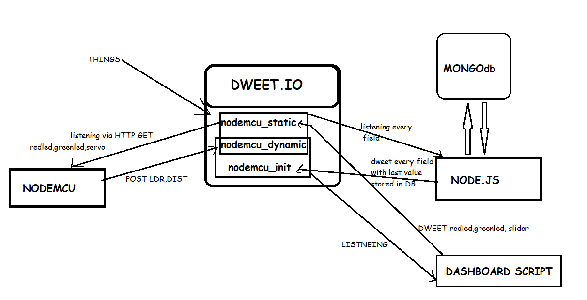
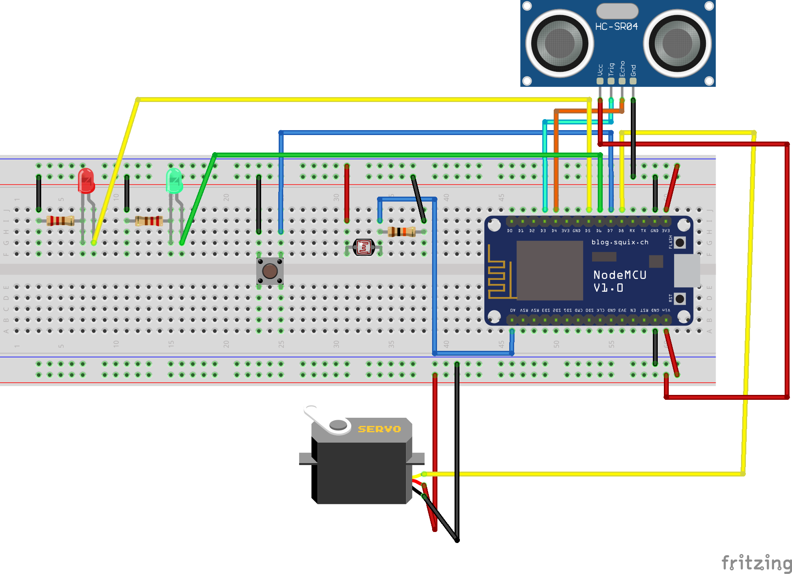
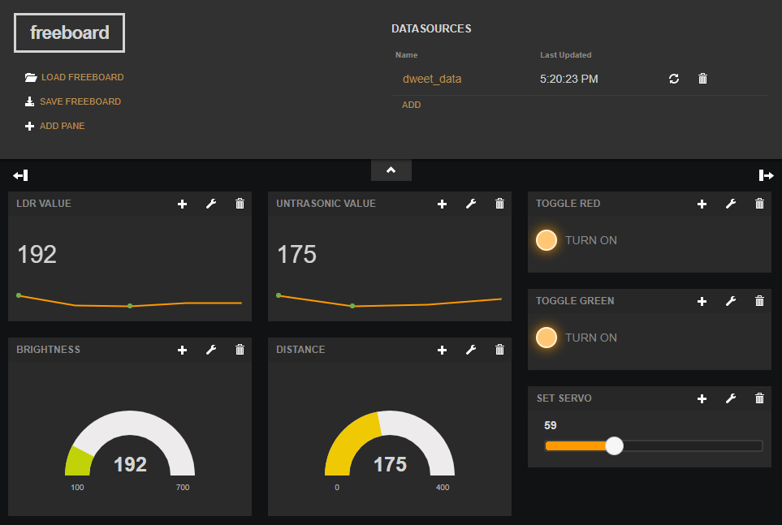
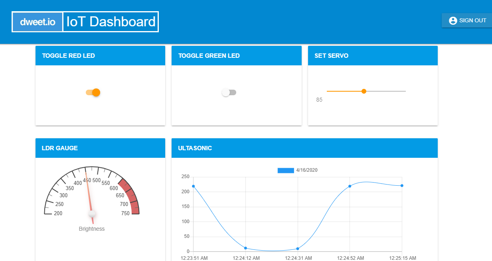

# IoT Session on Dweet.io, freeboard.io and Node.JS

## FILE DESCRIPTION

1. Arduino Code -> DweetGet2
2. Node.js server Code -> nodejs-app
3. freeboard json file -> freeboard

## ARCHTECTURE

## CIRCUIT DIAGRAM

## DATA VISUALISATION ON FREEBOARD

## DATA VISUALISATION ON NODE.JS

